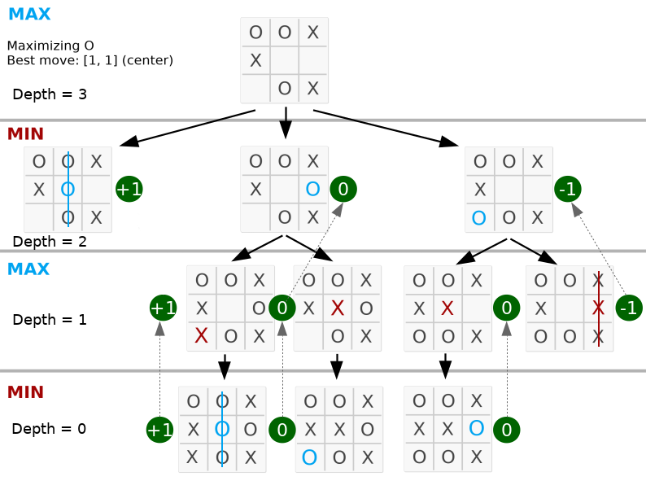

# Tic-Tac-Toe Game

An unbeatable Tic-Tac-Toe game built using **Minimax algorithm**. Play against an AI that always makes the optimal move!

## Features
- Implements Minimax algorithm for perfect play
- Game tree exploration with over **549,946 possible states**
- Written in **Python** with a simple, modular structure
- Interactive gameplay made with HTML/CSS and JavaScript

## Minimax Overview
- **Zero-sum game AI**: 3 possible outcomes- one player wins (+1), other loses (–1), or it’s a draw (0)
- Recursively explores all possible moves to guarantee the best outcome
- 
## How It Works
1. Build a game tree of all possible moves
2. Assign scores to terminal states (win = +1, loss = –1, draw = 0)
3. Backtrack scores through recursion to choose the optimal move

	</img>

Take a look that the depth is equal the valid moves on the board. The complete code is available in **python/**.

Simplified game tree:

	</img>

## References
- [Minimax on Wikipedia](https://en.wikipedia.org/wiki/Minimax)
- [Tic-Tac-Toe AI by NTU](https://www.ntu.edu.sg/home/ehchua/programming/java/JavaGame_TicTacToe_AI.html)

